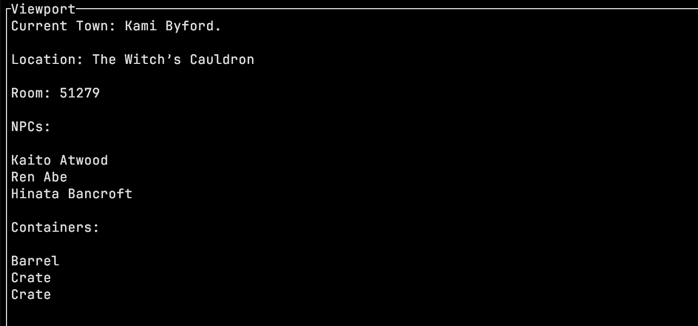

# CLI Town Explorer

CLI interface for exploring towns generated by [CLI Town Generator](https://github.com/hexensemble/cli-town-generator), built with Rust. 🔎

 

**Download:** https://github.com/hexensemble/cli-town-explorer/releases

 

**Features:** 

- 🖥️ Ratatui UI Implementation
- 🎭 Character Naming
- 🌍 World Loading
- 🏰 Town Exploration
- 🏠 Building Exploration
- 🎠 Travel System
- 🌙 Day/Night and Weather System (Threaded time/weather simulation)
- 💾 Save/Load System
- 📝 Logging
